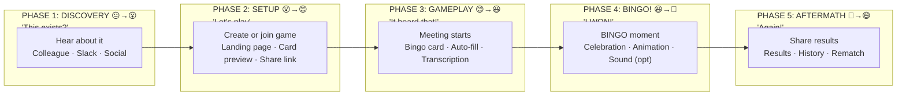

# Meeting Bingo — User Experience Research

**Version**: 1.0  
**Date**: December 11, 2025  
**Status**: Ready for PRD Development  
**Research Type**: Generative + Evaluative  

---

## Executive Summary

Meeting Bingo transforms the universal frustration of corporate meetings into an engaging game that increases attendee alertness and creates shared moments of delight. By combining traditional bingo mechanics with live audio transcription, the application automatically detects buzzwords and jargon, filling squares in real-time without manual interaction.

**Core Insight**: Meetings are a universal pain point. Rather than fighting this reality, Meeting Bingo channels attention toward active listening while creating moments of genuine fun. The auto-fill transcription feature removes the friction of manual tracking, allowing players to stay engaged with meeting content while the game plays itself.

---

## Research Objectives

### Primary Questions
1. What behaviors and frustrations do professionals exhibit during meetings?
2. How can gamification increase engagement without disrupting meeting participation?
3. What technical approach enables frictionless, automatic gameplay?
4. What moments create delight vs. distraction?

### Secondary Questions
1. How do different meeting types (standup, all-hands, client call) affect gameplay needs?
2. What social dynamics emerge from multiplayer bingo during meetings?
3. How do users feel about audio transcription in meeting contexts?

---

## User Personas

### Persona 1: The Meeting Survivor — "Maya"

| Attribute | Description |
|-----------|-------------|
| **Role** | Senior Product Manager, 8 years experience |
| **Meeting Load** | 15-25 hours/week in meetings |
| **Pain Points** | Meeting fatigue, repetitive discussions, difficulty staying engaged |
| **Tech Comfort** | High — uses multiple productivity tools daily |
| **Social Style** | Enjoys team bonding, appreciates workplace humor |

**Maya's Story**: "I spend half my week in meetings. Some are valuable, but many feel like we're saying the same things over and over. I've started counting how many times someone says 'synergy' just to stay awake. I wish there was a way to make these meetings feel less draining."

**Key Quote**: "If I have to hear 'let's take this offline' one more time, I might scream. But silently. Because I'm on mute."

---

### Persona 2: The Remote Worker — "Dev"

| Attribute | Description |
|-----------|-------------|
| **Role** | Software Engineer, 4 years experience |
| **Meeting Load** | 8-12 hours/week (standups, sprint planning, retros) |
| **Pain Points** | Zoom fatigue, feeling disconnected from team, video call monotony |
| **Tech Comfort** | Very high — builds tools for fun |
| **Social Style** | Introverted but values team connection |

**Dev's Story**: "Working remote is great for focus time, but video calls all blur together. I miss the spontaneous fun of being in an office. My team tried virtual happy hours but they felt forced. I want something that makes our regular meetings more fun without adding another meeting."

**Key Quote**: "I already have a mental bingo card for every standup. 'Blocked by dependencies' — that's the free space."

---

### Persona 3: The Team Lead — "Jordan"

| Attribute | Description |
|-----------|-------------|
| **Role** | Engineering Manager, manages team of 8 |
| **Meeting Load** | 20+ hours/week (1:1s, team meetings, cross-functional) |
| **Pain Points** | Keeping team engaged, making meetings feel worthwhile, fighting meeting bloat |
| **Tech Comfort** | High — always trying new team tools |
| **Social Style** | Team culture champion, values psychological safety |

**Jordan's Story**: "I can see my team zoning out in all-hands meetings. I've tried to make our team meetings better, but there's only so much I can do when half the meeting is corporate updates. I want a way to create inside jokes and shared experiences that make us feel like a team."

**Key Quote**: "The best team moments aren't in meetings — they're the jokes about meetings afterward. What if we could have those moments during the meeting?"

---

## User Journey Map

### Journey Overview



---

### Phase 1: Discovery

**Trigger**: User hears about Meeting Bingo from colleague or sees it in use during a meeting.

**User Thoughts**: 
- "Wait, this is a thing?"
- "That explains why they were smiling during the all-hands"
- "I need this in my life"

**Emotional State**: Curiosity → Amusement → Interest

**Key Moments**:
1. Seeing someone's reaction during a meeting (the knowing smile)
2. Receiving a game invite link
3. Hearing about the auto-transcription feature

**Design Implications**:
- Shareability is critical — the product spreads through witnessed delight
- First impression must immediately communicate the concept
- Social proof (player count, games played) builds credibility

---

### Phase 2: Setup

**Trigger**: User decides to try Meeting Bingo before an upcoming meeting.

**User Thoughts**:
- "How does this work?"
- "Can I customize the words?"
- "How do I get others to play?"

**Emotional State**: Curiosity → Anticipation → Excitement

**Actions**:
1. Visit landing page
2. Choose: Create new game OR Join existing game
3. If creating: Select buzzword category or customize
4. Preview bingo card
5. Enable microphone for transcription
6. Share game link with others (optional)

**Key Moments**:
1. **Card Preview**: First time seeing their unique card
2. **Microphone Permission**: Moment of trust decision
3. **Share Action**: Inviting others creates social commitment

**Pain Points**:
- Microphone permission anxiety ("Is this recording me?")
- Decision paralysis on word selection
- Uncertainty about whether teammates will participate

**Design Implications**:
- Clear privacy messaging (local processing, no recording)
- Pre-built category packs reduce decision burden
- Easy share mechanics (copy link, Slack integration)
- Solo mode must be fun (no dependency on others)

---

### Phase 3: Gameplay

**Trigger**: Meeting begins, user has Meeting Bingo open alongside video call.

**User Thoughts**:
- "Come on, say 'synergy'..."
- "IT HEARD THAT! Amazing!"
- "Two more for bingo!"

**Emotional State**: Anticipation → Surprise → Engagement → Excitement

**Actions**:
1. Position bingo card (second monitor, phone, or picture-in-picture)
2. Start transcription when meeting begins
3. Watch for auto-fills as buzzwords are detected
4. Optional: manually tap squares for words transcription missed
5. Track progress toward bingo

**Key Moments**:
1. **First Auto-Fill**: "It actually works!" — moment of delight and trust
2. **Near Miss**: One square away from bingo — peak tension
3. **Rare Word Hit**: Uncommon buzzword detected — bonus excitement
4. **Multiplayer Awareness**: Seeing others' progress adds competition

**Pain Points**:
- Transcription misses a word that was clearly said
- Card positioning awkward on small screens
- Uncertainty if transcription is working
- Distraction from actual meeting content

**Design Implications**:
- Visual feedback confirming transcription is active
- Prominent auto-fill animation when words detected
- Manual tap fallback for missed words
- Minimal UI that doesn't demand attention
- Progress indicator shows proximity to bingo

---

### Phase 4: BINGO!

**Trigger**: Five squares align — horizontal, vertical, or diagonal.

**User Thoughts**:
- "YES! I won!"
- "I can't laugh out loud, I'm on mute"
- "I need to share this"

**Emotional State**: Anticipation → PEAK JOY → Pride → Desire to share

**Actions**:
1. Experience celebration animation
2. See winning card highlighted
3. View leaderboard position (if multiplayer)
4. Option to screenshot/share result
5. Continue playing for additional bingos or close

**Key Moments**:
1. **The Win Moment**: Celebration must feel earned and exciting
2. **Silent Celebration**: User can't cheer aloud — UI must celebrate for them
3. **Social Proof**: Seeing "You beat 3 others!" or "First to bingo!"

**Pain Points**:
- Celebration too loud/visible (boss sees)
- Anticlimactic win (weak animation)
- Game ends abruptly
- No record of the achievement

**Design Implications**:
- Satisfying but discreet celebration (confetti, not airhorn)
- Sound optional and off by default
- Screenshot-ready winning card
- Achievement saved to history
- Option to continue for "blackout" or multiple bingos

---

### Phase 5: Aftermath

**Trigger**: Meeting ends, user reflects on the game.

**User Thoughts**:
- "That was actually fun"
- "I should share this with the team"
- "Same time next week?"

**Emotional State**: Satisfaction → Amusement → Social connection

**Actions**:
1. View game summary (words hit, time to bingo)
2. Share results to Slack/team chat
3. View leaderboard standings
4. Schedule next game or bookmark for recurring meeting
5. Tell colleagues about it

**Key Moments**:
1. **Shareable Summary**: One-click share of results
2. **Inside Joke Creation**: "Remember when they actually said 'move the needle'?"
3. **Rematch Setup**: Easy to play again next meeting

**Pain Points**:
- Results disappear after closing
- No easy way to share
- Have to recreate game each time
- Forgetting to use it next meeting

**Design Implications**:
- Persistent game history
- One-click share with preview image
- Recurring game links (same buzzwords each week)
- Calendar integration or reminder feature

---

## Storyboard: Maya's First Meeting Bingo Experience

### Scene 1: Discovery (10am, Monday)
```
┌─────────────────────────────────────────────────────────────────┐
│                                                                 │
│   [All-Hands Video Call Screen]                                │
│                                                                 │
│   ┌─────────┐  ┌─────────┐  ┌─────────┐  ┌─────────┐          │
│   │  CEO    │  │  Maya   │  │  Alex   │  │  Others │          │
│   │ 😐      │  │ 😴      │  │ 😏      │  │ ...     │          │
│   └─────────┘  └─────────┘  └─────────┘  └─────────┘          │
│                                                                 │
│   CEO: "...and we need to leverage our synergies to..."        │
│                                                                 │
│   Maya notices Alex suddenly smirk at the word "synergies"     │
│                                                                 │
│   💭 Maya: "What's so funny?"                                  │
│                                                                 │
└─────────────────────────────────────────────────────────────────┘
```

### Scene 2: The Reveal (10:45am, after meeting)
```
┌─────────────────────────────────────────────────────────────────┐
│                                                                 │
│   [Slack DM with Alex]                                         │
│                                                                 │
│   Maya: "Ok what was so funny during the all-hands?"           │
│                                                                 │
│   Alex: "😂 Meeting Bingo! I got bingo when she said synergy"  │
│   Alex: "meetingbingo.app - it transcribes and auto-fills"     │
│   Alex: "Try it tomorrow, it's amazing"                        │
│                                                                 │
│   Maya: "Wait this auto-detects the words?? I'm in"            │
│                                                                 │
│   💭 Maya: "This changes everything"                           │
│                                                                 │
└─────────────────────────────────────────────────────────────────┘
```

### Scene 3: Setup (9:55am, Tuesday)
```
┌─────────────────────────────────────────────────────────────────┐
│                                                                 │
│   [Meeting Bingo Landing Page on Maya's laptop]                │
│                                                                 │
│   ┌─────────────────────────────────────────────────────────┐  │
│   │                                                         │  │
│   │            🎯 MEETING BINGO                             │  │
│   │                                                         │  │
│   │     Turn any meeting into a game                        │  │
│   │     Auto-fills when buzzwords are spoken!               │  │
│   │                                                         │  │
│   │     [🎮 Create Game]    [🔗 Join Game]                  │  │
│   │                                                         │  │
│   │     🔒 Audio processed locally. Never recorded.         │  │
│   │                                                         │  │
│   └─────────────────────────────────────────────────────────┘  │
│                                                                 │
│   💭 Maya: "Ok, sprint planning starts in 5 minutes..."       │
│                                                                 │
│   Maya clicks [Create Game]                                    │
│                                                                 │
└─────────────────────────────────────────────────────────────────┘
```

### Scene 4: Card Generation (9:56am)
```
┌─────────────────────────────────────────────────────────────────┐
│                                                                 │
│   [Card Category Selection]                                    │
│                                                                 │
│   ┌─────────────────────────────────────────────────────────┐  │
│   │  Choose your buzzword pack:                             │  │
│   │                                                         │  │
│   │  ┌──────────┐ ┌──────────┐ ┌──────────┐ ┌──────────┐   │  │
│   │  │ AGILE    │ │ CORPORATE│ │ TECH     │ │ CUSTOM   │   │  │
│   │  │ 🏃       │ │ 💼       │ │ 💻       │ │ ✏️        │   │  │
│   │  │ Sprint   │ │ Synergy  │ │ AI       │ │ Add your │   │  │
│   │  │ Blocker  │ │ Leverage │ │ Cloud    │ │ own...   │   │  │
│   │  │ Velocity │ │ Pivot    │ │ Scale    │ │          │   │  │
│   │  └──────────┘ └──────────┘ └──────────┘ └──────────┘   │  │
│   │                                          ✓ Selected     │  │
│   └─────────────────────────────────────────────────────────┘  │
│                                                                 │
│   💭 Maya: "Agile pack. Perfect for sprint planning."          │
│                                                                 │
│   Maya selects AGILE, clicks [Generate Card]                   │
│                                                                 │
└─────────────────────────────────────────────────────────────────┘
```

### Scene 5: Card Preview & Mic Permission (9:57am)
```
┌─────────────────────────────────────────────────────────────────┐
│                                                                 │
│   [Generated Bingo Card Preview]                               │
│                                                                 │
│   ┌─────────────────────────────────────────────────────────┐  │
│   │                    YOUR CARD                            │  │
│   │  ┌────────┬────────┬────────┬────────┬────────┐        │  │
│   │  │Sprint  │Blocker │Story   │Backlog │Velocity│        │  │
│   │  │        │        │Points  │        │        │        │  │
│   │  ├────────┼────────┼────────┼────────┼────────┤        │  │
│   │  │Standup │Retro   │Scrum   │Kanban  │Burndown│        │  │
│   │  │        │        │Master  │        │        │        │  │
│   │  ├────────┼────────┼────────┼────────┼────────┤        │  │
│   │  │Tech    │Scope   │ FREE   │Agile   │MVP     │        │  │
│   │  │Debt    │Creep   │ SPACE  │        │        │        │  │
│   │  ├────────┼────────┼────────┼────────┼────────┤        │  │
│   │  │Jira    │Epic    │User    │Deploy  │CI/CD   │        │  │
│   │  │        │        │Story   │        │        │        │  │
│   │  ├────────┼────────┼────────┼────────┼────────┤        │  │
│   │  │Release │Refactor│Hotfix  │PR      │Code    │        │  │
│   │  │        │        │        │Review  │Review  │        │  │
│   │  └────────┴────────┴────────┴────────┴────────┘        │  │
│   │                                                         │  │
│   │  [🔗 Invite Others]  [🎤 Enable Transcription]          │  │
│   │                                                         │  │
│   └─────────────────────────────────────────────────────────┘  │
│                                                                 │
│   ┌─────────────────────────────────────────────────────────┐  │
│   │ 🎤 Allow microphone access?                             │  │
│   │                                                         │  │
│   │ Meeting Bingo uses your microphone to detect buzzwords  │  │
│   │ in real-time. Audio is processed locally on your        │  │
│   │ device and is never recorded or sent to any server.     │  │
│   │                                                         │  │
│   │              [Deny]    [Allow]                          │  │
│   └─────────────────────────────────────────────────────────┘  │
│                                                                 │
│   💭 Maya: "Local processing, ok. That's fine."               │
│                                                                 │
│   Maya clicks [Allow]                                          │
│                                                                 │
└─────────────────────────────────────────────────────────────────┘
```

### Scene 6: Game Active — Waiting (10:00am)
```
┌─────────────────────────────────────────────────────────────────┐
│                                                                 │
│   [Split screen: Zoom on left, Meeting Bingo on right]         │
│                                                                 │
│   ┌───────────────────────┐  ┌─────────────────────────────┐   │
│   │                       │  │  🎯 MEETING BINGO           │   │
│   │    ZOOM MEETING       │  │  ────────────────────────   │   │
│   │                       │  │  🎤 Listening...            │   │
│   │   Sprint Planning     │  │  0/24 squares filled        │   │
│   │                       │  │                             │   │
│   │   Waiting for host... │  │  ┌────┬────┬────┬────┬────┐ │   │
│   │                       │  │  │    │    │    │    │    │ │   │
│   │                       │  │  ├────┼────┼────┼────┼────┤ │   │
│   │                       │  │  │    │    │    │    │    │ │   │
│   │                       │  │  ├────┼────┼────┼────┼────┤ │   │
│   │                       │  │  │    │    │ ⭐ │    │    │ │   │
│   │                       │  │  ├────┼────┼────┼────┼────┤ │   │
│   │                       │  │  │    │    │    │    │    │ │   │
│   │                       │  │  ├────┼────┼────┼────┼────┤ │   │
│   │                       │  │  │    │    │    │    │    │ │   │
│   │                       │  │  └────┴────┴────┴────┴────┘ │   │
│   └───────────────────────┘  └─────────────────────────────┘   │
│                                                                 │
│   💭 Maya: "Ready. Let's see if 'sprint' comes up first."      │
│                                                                 │
└─────────────────────────────────────────────────────────────────┘
```

### Scene 7: First Auto-Fill! (10:03am)
```
┌─────────────────────────────────────────────────────────────────┐
│                                                                 │
│   [Sprint planning underway]                                   │
│                                                                 │
│   Scrum Master: "Let's review the SPRINT BACKLOG and see      │
│                  what we can commit to this sprint..."         │
│                                                                 │
│   ┌───────────────────────┐  ┌─────────────────────────────┐   │
│   │    ZOOM MEETING       │  │  🎯 MEETING BINGO           │   │
│   │                       │  │  ────────────────────────   │   │
│   │   [Video of SM]       │  │  🎤 Listening...            │   │
│   │                       │  │  2/24 squares filled        │   │
│   │                       │  │                             │   │
│   │                       │  │  ┌────┬────┬────┬────┬────┐ │   │
│   │                       │  │  │ ✨ │    │    │ ✨ │    │ │   │
│   │                       │  │  │SPRN│    │    │BKLG│    │ │   │
│   │                       │  │  ├────┼────┼────┼────┼────┤ │   │
│   │                       │  │  │    │    │    │    │    │ │   │
│   │                       │  │  ├────┼────┼────┼────┼────┤ │   │
│   │                       │  │  │    │    │ ⭐ │    │    │ │   │
│   │                       │  │  └────┴────┴────┴────┴────┘ │   │
│   │                       │  │                             │   │
│   │                       │  │  🎉 "Sprint" detected!      │   │
│   │                       │  │  🎉 "Backlog" detected!     │   │
│   └───────────────────────┘  └─────────────────────────────┘   │
│                                                                 │
│   💭 Maya: "It works! Two squares already!" 😄                 │
│                                                                 │
└─────────────────────────────────────────────────────────────────┘
```

### Scene 8: Building Tension (10:15am)
```
┌─────────────────────────────────────────────────────────────────┐
│                                                                 │
│   [15 minutes in, card filling up]                             │
│                                                                 │
│   Developer: "I'm BLOCKED on the API integration, we          │
│               might have some TECH DEBT to address first..."   │
│                                                                 │
│   ┌─────────────────────────────────────────────────────────┐  │
│   │  🎯 MEETING BINGO                                       │  │
│   │  ────────────────────────────────────────               │  │
│   │  🎤 Listening... | 11/24 squares filled | 🔥 CLOSE!     │  │
│   │                                                         │  │
│   │  ┌────────┬────────┬────────┬────────┬────────┐        │  │
│   │  │ ✅     │ ✅     │ ✅     │ ✅     │        │        │  │
│   │  │Sprint  │Blocker │Story   │Backlog │Velocity│        │  │
│   │  ├────────┼────────┼────────┼────────┼────────┤        │  │
│   │  │ ✅     │ ✅     │        │        │        │        │  │
│   │  │Standup │Retro   │Scrum   │Kanban  │Burndown│        │  │
│   │  ├────────┼────────┼────────┼────────┼────────┤        │  │
│   │  │ ✨     │        │ ⭐     │ ✅     │        │        │  │
│   │  │Tech    │Scope   │ FREE   │Agile   │MVP     │  ← ONE │  │
│   │  │Debt    │Creep   │ SPACE  │        │        │  AWAY! │  │
│   │  ├────────┼────────┼────────┼────────┼────────┤        │  │
│   │  │        │ ✅     │ ✅     │ ✅     │        │        │  │
│   │  │Jira    │Epic    │User    │Deploy  │CI/CD   │        │  │
│   │  ├────────┼────────┼────────┼────────┼────────┤        │  │
│   │  │        │        │        │        │        │        │  │
│   │  │Release │Refactor│Hotfix  │PR      │Code    │        │  │
│   │  └────────┴────────┴────────┴────────┴────────┘        │  │
│   │                                                         │  │
│   │  ⚡ One away from BINGO! Need: "Scope Creep" or "MVP"   │  │
│   │                                                         │  │
│   └─────────────────────────────────────────────────────────┘  │
│                                                                 │
│   💭 Maya: "Come on... say 'scope creep'... I know you want   │
│             to..."                                              │
│                                                                 │
└─────────────────────────────────────────────────────────────────┘
```

### Scene 9: BINGO! (10:22am)
```
┌─────────────────────────────────────────────────────────────────┐
│                                                                 │
│   Product Owner: "Before we finalize, let's make sure we're    │
│                   not introducing any SCOPE CREEP here..."     │
│                                                                 │
│   ┌─────────────────────────────────────────────────────────┐  │
│   │                                                         │  │
│   │                 🎉🎊 BINGO! 🎊🎉                        │  │
│   │                                                         │  │
│   │  ┌────────┬────────┬────────┬────────┬────────┐        │  │
│   │  │ ✅     │ ✅     │ ✅     │ ✅     │        │        │  │
│   │  │Sprint  │Blocker │Story   │Backlog │Velocity│        │  │
│   │  ├────────┼────────┼────────┼────────┼────────┤        │  │
│   │  │ ✅     │ ✅     │        │        │        │        │  │
│   │  ├────────┼────────┼────────┼────────┼────────┤        │  │
│   │  │ ✅✨   │ ✅✨   │ ⭐✨   │ ✅✨   │ ✅✨   │  BINGO │  │
│   │  │Tech    │Scope   │ FREE   │Agile   │MVP     │  ────▶ │  │
│   │  │Debt    │Creep   │ SPACE  │        │        │        │  │
│   │  ├────────┼────────┼────────┼────────┼────────┤        │  │
│   │  │        │ ✅     │ ✅     │ ✅     │        │        │  │
│   │  ├────────┼────────┼────────┼────────┼────────┤        │  │
│   │  │        │        │        │        │        │        │  │
│   │  └────────┴────────┴────────┴────────┴────────┘        │  │
│   │                                                         │  │
│   │           ✨ Confetti animation plays ✨                 │  │
│   │                                                         │  │
│   │  Time to BINGO: 22 minutes                              │  │
│   │  Winning word: "Scope Creep"                            │  │
│   │                                                         │  │
│   │  [📸 Share Result]  [🔄 Keep Playing]                   │  │
│   │                                                         │  │
│   └─────────────────────────────────────────────────────────┘  │
│                                                                 │
│   💭 Maya: *stifles laugh* "Yes!! I can't believe that        │
│             actually worked!"                                   │
│                                                                 │
└─────────────────────────────────────────────────────────────────┘
```

### Scene 10: Share & Aftermath (10:45am, after meeting)
```
┌─────────────────────────────────────────────────────────────────┐
│                                                                 │
│   [Slack #dev-team channel]                                    │
│                                                                 │
│   Maya: *shares Meeting Bingo result card*                     │
│                                                                 │
│   ┌─────────────────────────────────────────────────────────┐  │
│   │  🎯 Maya got BINGO!                                     │  │
│   │  Sprint Planning | 22 minutes                           │  │
│   │  Winning word: "Scope Creep"                            │  │
│   │  12/24 squares filled                                   │  │
│   │                                                         │  │
│   │  [Play Meeting Bingo → meetingbingo.app]                │  │
│   └─────────────────────────────────────────────────────────┘  │
│                                                                 │
│   Alex: "🎉 Nice! I was close but needed 'velocity'"           │
│                                                                 │
│   Dev: "Wait you were both playing? I want in next time"       │
│                                                                 │
│   Jordan: "lol ok team, I see you. I'm in for the next        │
│            all-hands. Just don't tell leadership 😂"           │
│                                                                 │
│   Maya: "Here's the link for next time: [game link]"           │
│                                                                 │
│   💭 Maya: "Best sprint planning ever. Same time next week."   │
│                                                                 │
└─────────────────────────────────────────────────────────────────┘
```

---

## Key Moments Analysis

### Moment 1: First Auto-Fill (Critical Delight Moment)

**What Happens**: User hears a buzzword, sees the square automatically fill without any action.

**Why It Matters**: This is the "magic moment" that proves the product works. It creates trust in the transcription system and delivers on the core promise.

**Design Requirements**:
- Animation must be noticeable but not disruptive
- Clear visual connection between detected word and filled square
- Optional subtle audio cue
- Toast notification showing detected phrase
- Must feel instant (< 500ms from spoken to filled)

**Risk**: If transcription misses words frequently, this moment becomes frustration instead of delight.

---

### Moment 2: Near-Bingo Tension

**What Happens**: User has 4 squares in a row, needs one more for bingo.

**Why It Matters**: Peak engagement moment. User is now actively listening to the meeting hoping for specific words.

**Design Requirements**:
- Visual indicator showing proximity to bingo
- Highlight which word(s) would complete bingo
- Intensify visual feedback (pulsing border, color change)
- Show "One away!" notification

**Opportunity**: This is when users are most engaged with actual meeting content (listening for specific words).

---

### Moment 3: BINGO! Celebration

**What Happens**: Five squares align, user wins.

**Why It Matters**: This is the payoff for the entire experience. Must feel rewarding and shareable.

**Design Requirements**:
- Satisfying animation (confetti, highlight winning line)
- Discreet by default (user is still in meeting)
- Sound OFF by default, optional enable
- Clear winning state that persists
- Easy share/screenshot capability
- Show time to bingo and winning word
- Achievement saved to history

**Risk**: Over-celebration could be embarrassing/disruptive. Under-celebration feels anticlimactic.

---

### Moment 4: Share Result

**What Happens**: User shares their result with teammates after meeting.

**Why It Matters**: This is the viral loop that spreads the product. Each share is a new user acquisition opportunity.

**Design Requirements**:
- One-click share to Slack/clipboard
- Visual card optimized for social sharing
- Include game link for others to join
- Show key stats (time, winning word, squares filled)
- Mobile-friendly share experience

---

## Emotional Journey Graph

```
EMOTION
  ^
  |                                              🎉 BINGO!
  |                                             /   Peak Joy
  |                                    Near    /
  |                                   Bingo   /
  |                               Tension   /
  |                First         /        /
  |               Auto-fill    /        /
  |    Setup      Delight    /        /        Share &
  |   Complete      ✨     /        /          Remember
  |       |         |    /        /              😊
  | Start |         |  /        /                |
  |   😐  |    😊   |/   😆   /                  |
  |       |        /        /                    |
  |       |      /        /                      |
  |       |    /        /                        |
  |       |  /        /                          |
  +-------+/--------/----------------------------+-----> TIME
         Setup   Gameplay        Win          After
          5min    10-30min      instant       5min
```

---

## Design Principles Derived from Research

### Principle 1: Ambient Engagement
The game should enhance meeting attendance, not compete with it. UI must be minimal enough to keep in peripheral vision while staying engaged with meeting content.

### Principle 2: Earned Delight
Auto-fill moments should feel like small wins throughout the game, building to the bigger win of BINGO. Don't frontload all the dopamine.

### Principle 3: Silent Celebration
Users cannot cheer or react visibly in meetings. The UI must celebrate on their behalf in a way that's satisfying but professional.

### Principle 4: Trust Through Transparency
Microphone access is sensitive. Be explicit that audio is processed locally, never recorded, never transmitted. Build trust or lose users at the permission prompt.

### Principle 5: Social by Default
The game is more fun with others, but must be fully enjoyable solo. Social features enhance but don't gatekeep.

### Principle 6: Minimal Friction
Every tap is a distraction from the meeting. Maximize automation, minimize required interaction. The best game is one you barely have to play.

---

## Technical Requirements Derived from UXR

### Real-Time Transcription
- Must use browser-native Web Speech API (free, local processing)
- Fallback to manual tap if transcription unavailable
- Visual indicator showing transcription status
- Handle intermittent recognition gracefully

### Performance
- Card must render instantly (< 100ms)
- Auto-fill must appear within 500ms of word spoken
- Celebration animation must not lag or jank
- Works alongside video conferencing (minimal resource usage)

### Privacy
- No audio recording or transmission
- No user account required for basic play
- Game state stored locally by default
- Clear privacy policy and trust indicators

### Sharing
- Generate shareable image/card without server
- Include game link in share
- Optimized for Slack, Teams, Discord previews

---

## Success Metrics

### Engagement Metrics
- **Time to First Auto-Fill**: Target < 3 minutes (validates transcription working)
- **Games Completed**: Target > 70% of games started reach BINGO
- **Session Duration**: Target average game length 15-25 minutes (typical meeting)

### Viral Metrics
- **Share Rate**: Target > 30% of winners share result
- **Invite Rate**: Target > 20% of games have 2+ players
- **Return Rate**: Target > 40% of users play again within 7 days

### Quality Metrics
- **Transcription Accuracy**: Target > 80% of spoken buzzwords detected
- **Manual Override Rate**: Target < 20% of squares filled manually
- **Celebration Satisfaction**: Track via post-game micro-survey

---

## Open Research Questions

1. **Category Expansion**: What other meeting types need specialized word packs? (Sales calls, board meetings, client presentations)

2. **Competitive Dynamics**: Does showing other players' progress increase engagement or create pressure/distraction?

3. **Achievement Systems**: Would long-term achievement tracking increase retention? (Streaks, rare word collections)

4. **Corporate Adoption**: How do organizations feel about employees playing Meeting Bingo? Is there an "officially sanctioned" use case?

---

## Sources

Atlassian. "The State of Meetings Report." *Work Life by Atlassian*, 2024, https://www.atlassian.com/work-management/meetings.

Doodle. "The State of Meetings Report 2019." *Doodle Blog*, 2019, https://doodle.com/en/resources/research-and-reports/the-state-of-meetings-2019/.

Microsoft. "The New Future of Work Report 2024." *Microsoft Research*, 2024, https://www.microsoft.com/en-us/research/publication/the-new-future-of-work-report-2024/.

Mozilla Developer Network. "Web Speech API." *MDN Web Docs*, 2024, https://developer.mozilla.org/en-US/docs/Web/API/Web_Speech_API.

Rogelberg, Steven G. "The Surprising Science of Meetings." *Oxford University Press*, 2019.

---

*Document prepared for 021.School Workshop Development*  
*Next Step: Product Requirements Document*
